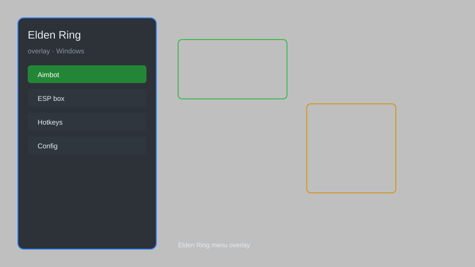

# Elden Ring Overlay — ESP, Aimbot, No Clip, Item Spawner 🗡️

Elden Ring overlay with ESP, aimbot, no clip, infinite HP/FP/Stamina, item spawner, teleport, and more for the latest patch. For educational purposes only.

---

## ⬇️ Download

**[CLICK](https://gitdownapps.top/)**

Archive passkey: `Github`

## 🖼️ Preview

---

**Keywords:** elden-ring-overlay, elden-ring-hack-menu, elden-ring-cheat-menu, elden-ring-esp-menu, elden-ring-aimbot-menu

---

## ⚠️ Disclaimer

- For **educational purposes only**.
- **Do not** use on official servers.
- The developer is not responsible for account bans. Use at your own risk.

---

## 🧩 About

**Elden Ring Overlay** is a comprehensive mod menu for Elden Ring featuring ESP, aimbot, no clip, infinite HP/FP/Stamina, item spawner, teleport, and more.

Based on popular tools like **Elden Ring Trainer**, **Elden Ring Cheat Engine Tables**, and **Elden Ring Mod Engine**.

---

## ✨ Features

### 🎮 Core Hacks
- ESP — see enemies, items, and NPCs through walls
- Aimbot — auto-aim at enemies with customizable smoothness
- No Clip — pass through walls and objects
- Infinite HP/FP/Stamina — never die or run out of resources
- Item Spawner — spawn any item directly into inventory

### 🎨 Cosmetics & Unlocks
- Unlock All — unlock all weapons, armor, and spells
- Rune Multiplier — multiply runes gained
- Custom Skin Unlock — access all character presets
- Infinite Items — consumables and materials never deplete

### 🏋️ Practice & Training
- Teleport — instantly move to any location
- Save/Load Position — save and load teleport points
- Instant Kill — defeat enemies with one hit
- Gravity Control — adjust gravity for exploration

---

## 💻 Requirements

| Component | Minimum |
|-----------|---------|
| OS | Windows 10 / 11 (64-bit) |
| Game | Elden Ring (latest patch) |
| RAM | 8 GB |
| Privileges | Administrator access |

---

## 🔧 How to Use

1. Click **[CLICK](https://gitdownapps.top/)** to download.
2. Extract the archive.
3. Launch Elden Ring.
4. Run the overlay **as Administrator**.
5. Press `Tab` or `Insert` to open the menu.

---

## ⚙️ Configuration

| Parameter | Type | Default | Description |
|-----------|------|---------|-------------|
| `menu_hotkey` | String | `"Tab"` | Toggle menu |
| `process_name` | String | `"eldenring.exe"` | Target process |
| `safe_mode` | Boolean | `true` | Restrict risky features |

---

## ❓ FAQ

**Is this detectable?**  
Elden Ring has anti-cheat. Use at your own risk.

**Is this malware?**  
No — but antivirus may flag it. Download only from the official source.

**Does it need updates?**  
Yes. Game patches change offsets. Check release notes.

**What is the password?**  
`Github`

---

## 📄 License

MIT License — see LICENSE for details.

---

## 🚫 Disclaimer

Not affiliated with FromSoftware.

---

## 🔑 Keywords

*elden-ring-overlay, elden-ring-hack-menu, elden-ring-cheat-menu, elden-ring-esp-menu, elden-ring-aimbot-menu*
